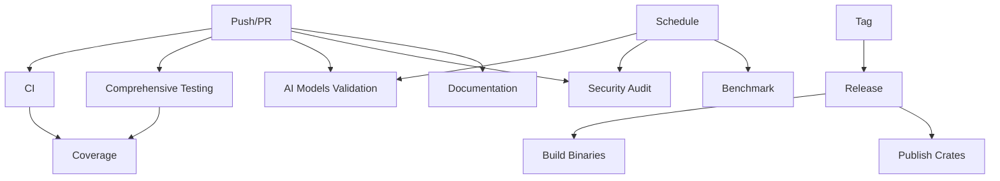

# GitHub Actions CI/CD Workflows

This directory contains comprehensive GitHub Actions workflows for the fingerprint-rust project.

## Workflow Overview

### 🔄 Continuous Integration

#### **ci.yml** - Main CI Pipeline
- **Triggers**: Push/PR to main, master, develop branches
- **Jobs**:
  - ✅ Test (Ubuntu/Windows/macOS, stable/beta Rust)
  - ✅ Coverage (Code coverage with llvm-cov)
  - ✅ Lint (fmt check, clippy)
  - ✅ Build (Release builds with various features)
- **Features Tested**: rustls-tls, compression, http2, http3, connection-pool, dns

#### **comprehensive-testing.yml** - Extended Test Suite
- **Triggers**: Push/PR, daily schedule
- **Jobs**:
  - 🧪 Unit Tests (cross-platform)
  - 🔗 Integration Tests
  - 📝 Example Tests
  - 🎯 Feature Combination Tests
  - 📦 Minimal Versions Test
- **Purpose**: Comprehensive testing across platforms and feature combinations

### 🤖 AI Models Specific

#### **ai-models-validation.yml** - AI Models Testing
- **Triggers**: Push/PR to AI models code, weekly schedule
- **Jobs**:
  - ✅ Validate fingerprint databases (JSON validation)
  - 🧪 Test AI models crate
  - 📊 Test detection accuracy
  - ⚡ Benchmark performance
  - 📈 Validate model coverage
- **Purpose**: Ensure AI detection quality and accuracy

### 🔒 Security

#### **security-audit.yml** - Security Scanning
- **Triggers**: Daily schedule, push/PR to main
- **Jobs**:
  - 🔍 Security audit (rustsec)
  - 🚫 Cargo deny (advisories, licenses)
- **Purpose**: Continuous security monitoring

### 📊 Quality & Performance

#### **coverage.yml** - Code Coverage
- **Triggers**: Push/PR to main
- **Jobs**:
  - 📈 Generate coverage with tarpaulin
  - ☁️ Upload to Codecov
- **Purpose**: Track code coverage metrics

#### **benchmark.yml** - Performance Benchmarks
- **Triggers**: Push/PR to main
- **Jobs**:
  - ⚡ Run cargo bench
- **Purpose**: Track performance regressions

### 📚 Documentation

#### **documentation.yml** - Documentation Build & Deploy
- **Triggers**: Push/PR affecting docs
- **Jobs**:
  - 📖 Check documentation
  - 🚀 Build and deploy docs (main branch only)
  - 🔗 Check documentation links
  - 📊 Generate documentation summary
- **Purpose**: Maintain high-quality documentation

### 📦 Dependencies

#### **dependencies.yml** - Dependency Review
- **Triggers**: Pull requests to main
- **Jobs**:
  - 🔍 Dependency review action
- **Purpose**: Review dependency changes

#### **dependabot.yml** - Automated Dependency Updates
- **Schedule**: Weekly
- **Ecosystems**:
  - 📦 Cargo dependencies
  - 🔄 GitHub Actions
- **Purpose**: Keep dependencies up-to-date

### 🚀 Release

#### **release.yml** - Release Automation
- **Triggers**: Version tags (v*.*.*), manual dispatch
- **Jobs**:
  - 📝 Create GitHub release with changelog
  - 🏗️ Build binaries (Linux, macOS, Windows)
  - 📤 Upload release assets
  - 📦 Publish to crates.io
- **Platforms**: x86_64-linux, x86_64-linux-musl, x86_64-macos, aarch64-macos, x86_64-windows
- **Purpose**: Automated release process

### 🐛 Fuzzing

#### **fuzz.yml** - Fuzz Testing
- **Triggers**: Push/PR to main, weekly schedule
- **Purpose**: Discover edge cases and crashes

## Workflow Dependencies



## Status Badges

Add these to your README.md:

```markdown


```

## Configuration Files

- `.github/dependabot.yml` - Dependabot configuration
- `.github/markdown-link-check-config.json` - Link checker configuration
- `deny.toml` - Cargo-deny configuration (licenses, advisories)

## Secrets Required

For full functionality, configure these secrets in your repository settings:

- `GITHUB_TOKEN` - Automatically provided by GitHub
- `CODECOV_TOKEN` - For Codecov uploads (optional)
- `CARGO_REGISTRY_TOKEN` - For publishing to crates.io (release only)

## Local Testing

Test workflows locally using [act](https://github.com/nektos/act):

```bash
# Install act
brew install act  # macOS
# or
curl https://raw.githubusercontent.com/nektos/act/master/install.sh | sudo bash

# Run CI workflow
act -j test

# Run linting
act -j lint

# Run specific job
act -j ai-models-test
```

## Customization

### Adding New Workflows

1. Create a new `.yml` file in `.github/workflows/`
2. Define triggers, jobs, and steps
3. Test locally with act
4. Commit and push

### Modifying Existing Workflows

1. Edit the workflow file
2. Validate YAML syntax: `python3 -c "import yaml; yaml.safe_load(open('file.yml'))"`
3. Test changes on a branch first
4. Monitor workflow runs in the Actions tab

## Best Practices

1. **Cache Dependencies**: All workflows use cargo cache for faster builds
2. **Fail Fast**: Use `--no-fail-fast` for comprehensive test results
3. **Parallel Jobs**: Run independent jobs in parallel
4. **Continue on Error**: Use `continue-on-error: true` for non-critical jobs
5. **Job Summaries**: Generate summaries for easy review

## Troubleshooting

### Workflow Fails on Fork

Some workflows require secrets. For fork PRs:
- CI will run with limited permissions
- Security audits will work
- Release workflows won't trigger

### Build Times

If builds are slow:
1. Check cache hit rates
2. Reduce feature combinations
3. Use `cargo-nextest` for faster tests
4. Adjust parallel job count

### Coverage Issues

If coverage upload fails:
- Check Codecov token
- Verify coverage generation
- Review tarpaulin output

## Maintenance

### Regular Tasks

- **Weekly**: Review Dependabot PRs
- **Monthly**: Check workflow efficiency
- **Quarterly**: Update GitHub Actions versions
- **Yearly**: Review and optimize workflow strategy

### Monitoring

Monitor workflows in:
- Actions tab: https://github.com/vistone/fingerprint-rust/actions
- Security tab: Vulnerability alerts
- Insights tab: Dependency graph

## Contributing

When adding new features:
1. Add appropriate workflow triggers
2. Ensure tests are comprehensive
3. Update this README
4. Test on your fork first

## Support

For workflow issues:
1. Check GitHub Actions logs
2. Review this documentation
3. Open an issue with workflow run link
4. Check GitHub Actions status: https://www.githubstatus.com/

---

**Last Updated**: 2026-02-16
**Maintained By**: fingerprint-rust team
