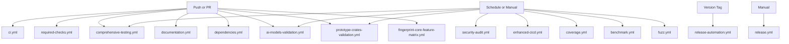

# GitHub Actions CI/CD Workflows

This directory contains the GitHub Actions workflows used to validate, audit, and release `fingerprint-rust`.

## Workflow Overview

The workflow set is intentionally split into four lanes:

1. `ci.yml`: routine default-member CI for the stable crate set.
2. `required-checks.yml`: strict full-workspace merge gate.
3. Specialized workflows: focused validation for AI models, prototype crates, core feature matrices, docs, coverage, and benchmarks.
4. Scheduled or manual deep audits: security scanning and the broader enhanced pipeline.

### Continuous Integration

#### `ci.yml` - Main Stable-Member CI
- **Triggers**: Push/PR to `main`, `master`, `develop`
- **Scope**: Default workspace members
- **Purpose**: Fast cross-platform validation for the stable support path
- **Jobs**:
  - Test on Ubuntu, Windows, and macOS with stable and beta Rust
  - Coverage with `cargo-llvm-cov`
  - Lint with `rustfmt` and `clippy`
  - Release-profile builds
- **Feature combinations**:
  - `rustls-tls,compression,http2`
  - `rustls-tls,compression,http2,connection-pool`
  - `rustls-tls,compression,http2,connection-pool,dns`

#### `required-checks.yml` - Full Workspace Merge Gate
- **Triggers**: Push/PR to `main`, `master`, `develop`
- **Scope**: Entire workspace
- **Purpose**: Required branch-protection gate covering preview and prototype crates as well as stable crates
- **Jobs**:
  - Full-workspace tests
  - Full-workspace formatting and clippy
  - Full-workspace build on Ubuntu, Windows, and macOS
  - Merge-blocking security advisory check

#### `comprehensive-testing.yml` - Full Workspace Regression Suite
- **Triggers**: Push/PR, daily schedule
- **Scope**: Entire workspace
- **Purpose**: Broader regression and compatibility coverage beyond the default-member CI path
- **Jobs**:
  - Unit, integration, and doc tests
  - Example builds
  - Feature-combination checks
  - Minimal-version validation

### Focused Validation

#### `ai-models-validation.yml` - AI Models Validation
- **Triggers**: Push/PR touching AI model assets, weekly schedule
- **Purpose**: Validate fingerprint datasets, crate behavior, and model-specific quality signals

#### `prototype-crates-validation.yml` - Prototype Crates Validation
- **Triggers**: Push/PR touching prototype crates, weekly schedule
- **Purpose**: Keep prototype crates explicitly tested without pushing them into the default stable-member lane

#### `fingerprint-core-feature-matrix.yml` - `fingerprint-core` Service Feature Matrix
- **Triggers**: Push/PR touching `fingerprint-core`, weekly schedule
- **Purpose**: Guard the split between core functionality and opt-in service features

#### `coverage.yml` - Tarpaulin Coverage
- **Triggers**: Push to `main`, manual dispatch
- **Scope**: Default workspace members
- **Purpose**: Publish coverage metrics independently from the main CI workflow without duplicating PR coverage runs

#### `benchmark.yml` - Benchmark Build Validation
- **Triggers**: Push to `main`, manual dispatch
- **Scope**: Default workspace members
- **Purpose**: Track benchmark regressions and ensure benchmark targets still build without making every PR pay the benchmark cost

#### `documentation.yml` - Documentation Build and Checks
- **Triggers**: Push/PR affecting docs or crate source
- **Scope**: Default members for `cargo doc`; repository-wide markdown and link checks remain unchanged
- **Purpose**: Keep generated Rust docs and repository documentation healthy

#### `dependencies.yml` - Dependency Review
- **Triggers**: Pull requests to `main`
- **Purpose**: Review dependency changes through GitHub's dependency-review action

#### `fuzz.yml` - Fuzz Testing
- **Triggers**: Push/PR to `main`, weekly schedule
- **Purpose**: Discover crashes and edge cases with fuzz targets

### Scheduled and Manual Deep Audits

#### `security-audit.yml` - Security Scanning
- **Triggers**: Daily schedule, manual dispatch
- **Purpose**: Run security monitoring outside the PR path to avoid duplicating merge-gate checks
- **Jobs**:
  - RustSec audit
  - `cargo-deny` advisories, bans, licenses, and sources checks

#### `enhanced-cicd.yml` - Deep Validation Pipeline
- **Triggers**: Weekly schedule, manual dispatch
- **Scope**: Primarily default members, plus deep checks such as Miri
- **Purpose**: Consolidated heavyweight validation lane for periodic audits and on-demand investigation
- **Jobs**:
  - Lint and formatting
  - Security audit with `cargo-audit` and `cargo-deny`
  - Multi-platform compile and test
  - Coverage, docs, feature matrix, benchmarks
  - Miri undefined-behavior checks

### Release

#### `release-automation.yml` - Primary Release Automation
- **Triggers**: Version tags matching `vX.Y.Z`, manual dispatch
- **Purpose**: Main release path for validated stable-member releases
- **Jobs**:
  - Release validation
  - Binary builds
  - Crates publishing
  - GitHub release creation

#### `release.yml` - Manual Release Assets
- **Triggers**: Manual dispatch
- **Purpose**: Manual fallback and extended artifact build workflow; intentionally not tag-triggered to avoid duplicate releases
- **Platforms**:
  - `x86_64-linux`
  - `x86_64-linux-musl`
  - `x86_64-macos`
  - `aarch64-macos`
  - `x86_64-windows`

## Workflow Topology


```mermaid
graph TD
    A[Push or PR] --> B[ci.yml]
    A --> C[required-checks.yml]
    A --> D[comprehensive-testing.yml]
    A --> G[documentation.yml]
    A --> H[dependencies.yml]
    A --> I[ai-models-validation.yml]
    A --> J[prototype-crates-validation.yml]
    A --> K[fingerprint-core-feature-matrix.yml]

    L[Schedule or Manual] --> M[security-audit.yml]
    L --> N[enhanced-cicd.yml]
    L --> E[coverage.yml]
    L --> F[benchmark.yml]
    L --> D
    L --> I
    L --> J
    L --> O[fuzz.yml]

    P[Version Tag] --> Q[release-automation.yml]
    R[Manual] --> S[release.yml]
```

## Configuration Files

- `.github/dependabot.yml` - Dependabot configuration
- `.github/markdown-link-check-config.json` - Link checker configuration
- `deny.toml` - Cargo-deny configuration (licenses, advisories)

## Secrets Required

For full functionality, configure these secrets in your repository settings:

- `GITHUB_TOKEN` - Automatically provided by GitHub
- `CODECOV_TOKEN` - For Codecov uploads (optional)
- `CARGO_REGISTRY_TOKEN` - For publishing to crates.io (release only)

## Local Testing

Test workflows locally using [act](https://github.com/nektos/act):

```bash
# Install act
brew install act  # macOS
# or
curl https://raw.githubusercontent.com/nektos/act/master/install.sh | sudo bash

# Run the main CI test job
act -j test

# Run linting
act -j lint

# Run a specific specialized job
act -j ai-models-test
```

## Customization

### Adding New Workflows

1. Create a new `.yml` file in `.github/workflows/`
2. Define triggers, jobs, and steps
3. Test locally with act
4. Commit and push

### Modifying Existing Workflows

1. Edit the workflow file
2. Validate YAML syntax: `python3 -c "import yaml; yaml.safe_load(open('file.yml'))"`
3. Test changes on a branch first
4. Monitor workflow runs in the Actions tab

## Best Practices

1. **Cache Dependencies**: All workflows use cargo cache for faster builds
2. **Fail Fast**: Use `--no-fail-fast` for comprehensive test results
3. **Parallel Jobs**: Run independent jobs in parallel
4. **Continue on Error**: Use `continue-on-error: true` for non-critical jobs
5. **Job Summaries**: Generate summaries for easy review

## Troubleshooting

### Workflow Fails on Fork

Some workflows require secrets. For fork PRs:
- CI will run with limited permissions
- Scheduled and manual audit workflows remain maintainers-only
- Release workflows won't trigger

### Build Times

If builds are slow:
1. Check cache hit rates
2. Reduce feature combinations
3. Use `cargo-nextest` for faster tests
4. Adjust parallel job count

### Coverage Issues

If coverage upload fails:
- Check Codecov token
- Verify coverage generation
- Review tarpaulin output

## Maintenance

### Regular Tasks

- **Weekly**: Review Dependabot PRs
- **Monthly**: Check workflow efficiency
- **Quarterly**: Update GitHub Actions versions
- **Yearly**: Review and optimize workflow strategy

### Monitoring

Monitor workflows in:
- Actions tab: https://github.com/vistone/fingerprint-rust/actions
- Security tab: Vulnerability alerts
- Insights tab: Dependency graph

## Contributing

When adding new features:
1. Add appropriate workflow triggers
2. Ensure tests are comprehensive
3. Update this README
4. Test on your fork first

## Support

For workflow issues:
1. Check GitHub Actions logs
2. Review this documentation
3. Open an issue with workflow run link
4. Check GitHub Actions status: https://www.githubstatus.com/

---

**Last Updated**: 2026-03-18
**Maintained By**: fingerprint-rust team
