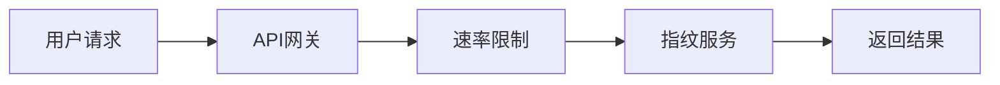

# 系统架构设计

**版本**: v1.0  
**最后更新**: 2026-02-13  
**文档类型**: 技术文档

---


## 🏗️ 整体架构

fingerprint-rust 采用模块化的 Cargo Workspace 架构，包含20个独立的crate。

```
fingerprint-rust/
├── crates/
│   ├── fingerprint-core/          # 核心类型和工具
│   ├── fingerprint-tls/           # TLS指纹生成
│   ├── fingerprint-profiles/      # 浏览器配置文件
│   ├── fingerprint-http/          # HTTP客户端
│   ├── fingerprint-gateway/       # API网关(Rust) ✅ 推荐
│   └── ...                        # 其他功能模块
├── config/                        # 配置文件
└── docs/                          # 文档中心
```

## 🎯 核心设计理念

### 1. 模块化设计
每个crate都有明确的职责边界，遵循单一职责原则。

### 2. 零依赖哲学
核心功能不依赖外部服务，确保高可用性。

### 3. 性能优先
使用Rust语言特性优化性能，支持高并发场景。

## 🔧 技术栈

### 核心库 (100% Rust)
- **语言**: Rust 2021 Edition
- **异步运行时**: Tokio
- **TLS实现**: rustls + ring
- **HTTP/2**: h2 crate
- **HTTP/3**: quinn + h3

### 可选服务
- **API网关**: actix-web (Rust) ✅ 推荐
- **ML服务**: Python (正在迁移至Rust)

## 🔄 数据流



## 🛡️ 安全架构

### 多层防护
1. **网络层**: TLS 1.3加密
2. **应用层**: 输入验证和 sanitization
3. **业务层**: 速率限制和访问控制

### 密钥管理
使用 `ring` 库生成真实的加密密钥对，支持:
- X25519 (现代加密)
- P-256 (NIST标准)
- P-384 (高安全级别)

## 📊 性能架构

### 连接池
集成 `netconnpool-rust` 实现高效的连接复用。

### 缓存策略
- L1: 内存缓存
- L2: Redis缓存 (可选)
- L3: 持久化存储

### 异步处理
全异步架构支持高并发请求处理。

## 🚀 部署架构

### 容器化部署
```yaml
# docker-compose.yml 示例
version: '3.8'
services:
  fingerprint-api:
    image: fingerprint-rust:latest
    ports:
      - "8080:8080"
    environment:
      - RUST_LOG=info
```

### Kubernetes部署
支持完整的K8s部署，包含:
- 水平Pod自动扩缩容(HPA)
- 服务网格集成
- 监控和告警

## 🔭 未来架构规划

### Phase 9.5: 计费系统
- 使用量追踪
- 订阅管理
- 支付集成

### Phase 10: AI增强
- 机器学习驱动的指纹识别
- 异常检测
- 自适应防护

---
*有关特定组件的详细信息，请参阅相应的模块文档。*